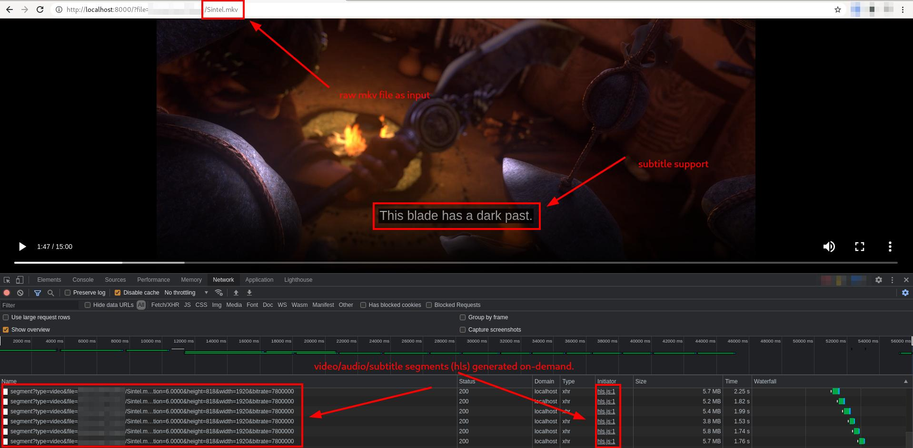

# Instant
Instant is an attempt to stream a video file (e.g. mkv) through hls on-demand. Instead of pre-creating the hls stream, all data is generated dynamically on request through ffmpeg.

## Usage
Start the server trough `go run main.go` or simply build the Docker container and start it e.g `docker run -d -p 8000:8000 -v <folder>:<mountpoint> --name instant <image-name>`

After that open your browser and go to:
`http://locahost:8000?file=<absolute uri to mkv file>`

That's it for now.

## Scope
The scope for this project is very simple: It should just stream media on-demand, nothing else. If you want a fully fledged media library, use [jellyfin](https://github.com/jellyfin/jellyfin) or something else.

I also want to use the least amount of libraries as possible. Currently I only use [ffmpeg](https://github.com/FFmpeg/FFmpeg) and [hls.js](https://github.com/video-dev/hls.js) and no third-party libraries in golang.

Of course I want to make it a bit more configurable, like multiple resolutions, bitrates, file browser, etc.

## Problems
Obviously this is not really usable right now
- There is still a problem with cut-off audio between segments (~40ms). This has the consequence that audio is unfortunately off-sync after some time. I still haven't found a solution for that problem.

## License
Do whatever you want with it, I don't really care.